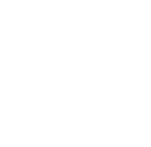

## Project Title:

    Dice Game - Pass the Pigs

## Project Description:

     A web based game that is based on chance. You can take as many turns as you dare until either: You decide to stop and record your total score for that turn. You throw a “Pig Out” and score “0” for that round. You throw an “Oinker” and lose all your points accumulated in the game so far. (Based on a famous real world game called “Pass the Pigs”)

## Tech Stack Used:

 

## Tools Used:

 

## Project Preview

##### Initial Page

##### Mid Game

##### End Game

